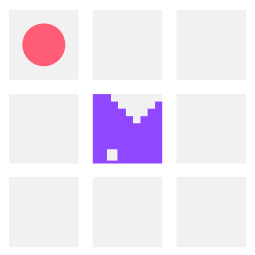

# ChatSnek

Twitch chat plays [Battlesnake][battlesnake].

## Live Events

If you'd like to participate in live games with ChatSnek, follow
[BattlesnakeOfficial](battlesnake-twitch) and [Xtagon](xtagon-twitch) on
Twitch.

## How It Works

ChatSnek listens for these commands in the Twitch chat for BattlesnakeOfficial:

- `!up`
- `!down`
- `!left`
- `!right`

When ChatSnek plays a turn for a game of Battlesnake, it waits a small amount
of time (depending on the game's timeout setting) and then plays the move
corresponding to the highest voted direction from the chat.

## Open Invite

If you have any questions, or just wish to geek out and chat about Battlesnake
or Elixir or programming in general, feel free to reach out! I love talking
with people and sharing tips and tricks.

You can reach me at [xtagon@gmail.com](mailto:xtagon@gmail.com), or catch me in
[Battlesnake Discord][battlesnake-discord] (username: `@xtagon`).

## License

This project is released under the terms of the [MIT License](LICENSE.txt).

[battlesnake]: https://play.battlesnake.com/
[battlesnake-discord]: https://play.battlesnake.com/discord/
[battlesnake-twitch]: https://www.twitch.tv/battlesnakeofficial
[xtagon-twitch]: https://www.twitch.tv/xtagon
